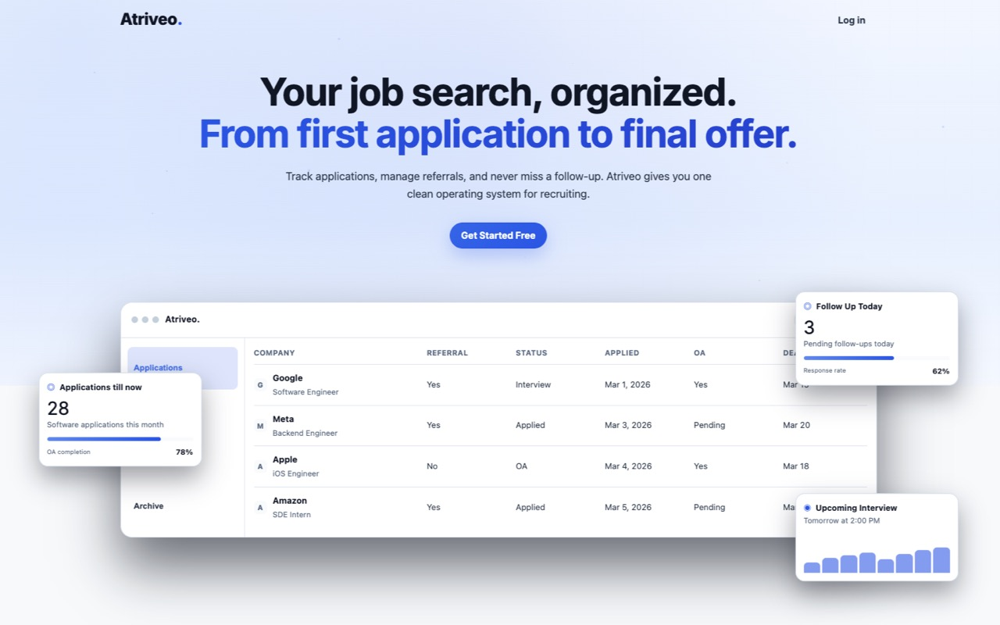
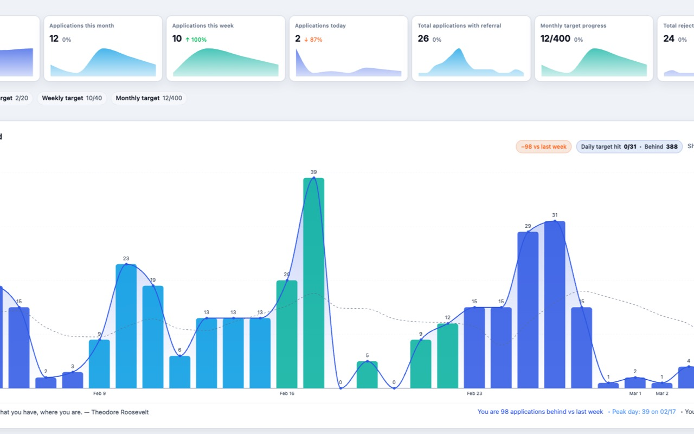
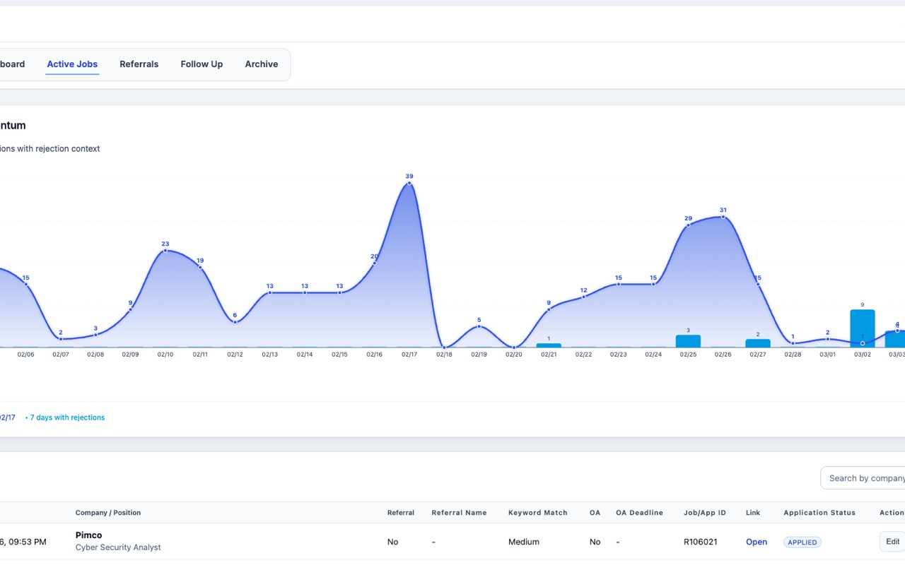

# Atriveo — Job Application Intelligence Platform

An end-to-end system that auto-captures job applications via a Chrome extension, tracks them through a full-featured dashboard, and surfaces network-level insights through a social layer — all running on a serverless edge stack.

---

## Demo

**Landing page + applications tracker**


**Analytics dashboard — daily/weekly/monthly trend charts**


**Active jobs + momentum chart**


Live: [atriveo.com](https://atriveo.com)  
Chrome Extension: [Atriveo Job Assistant](https://chromewebstore.google.com)

---

## Problem

Job searching at scale is broken:

- Applications are logged manually across spreadsheets, notes apps, and email
- No visibility into what your network is applying to or when deadlines hit
- Online assessments, referrals, and follow-ups have no unified home
- Career sites vary wildly — there's no standard way to capture a job in one click

---

## Solution

Atriveo brings everything into one system:

- **Chrome extension** detects ATS and career pages, extracts job metadata, and logs applications with one click
- **Dashboard** tracks jobs, OA status, referrals, notes, and pending follow-ups in one place
- **Network layer** lets you see (with permission) what friends are applying to, surface trends, and stay deadline-aware
- **Daily digest** emails surface your pipeline state every morning
- **Targets** let you set monthly/daily goals and track progress in real time

---

## Architecture

```
Chrome Extension
      │
      │  POST /api/extension/applications
      ▼
Cloudflare Worker API (Hono)
      │
      ├── Auth (Email / Google OAuth)
      ├── Jobs, OA, Referrals, Notes, Pending
      ├── Social: Friends, Network, Field Visibility
      ├── Media (Cloudflare R2)
      ├── Targets + Progress
      └── Scheduled: Daily Digest Crons (Resend)
      │
      ▼
PostgreSQL (Neon — serverless)
      ▲
      │
React SPA (Vite)          FastAPI Integration Service
(Cloudflare Pages)        (Per-user encrypted credentials,
                           outbound proxy for integrations)
```

36 ordered SQL migrations track every schema change from initial schema to friends, digest sends, media, password reset, and company directory.

---

## Tech Stack

| Layer | Technology |
|---|---|
| Frontend | React 18, React Router 6, Recharts, Vite 6, TypeScript |
| Primary API | Hono 4, Cloudflare Workers, Zod, TypeScript |
| Integration API | FastAPI, SQLAlchemy 2, python-jose, httpx |
| Database | PostgreSQL 16 (local Docker), Neon (production) |
| Storage | Cloudflare R2 (S3-compatible) |
| Auth | Email/password, Google OAuth, JWT |
| Email | Resend (daily digests, password reset) |
| Extension | Chrome MV3, service worker, content scripts |
| Deployment | Cloudflare Workers + Pages, GitHub Actions CI |
| Analytics | Google Analytics 4 |

---

## Features

**Application Tracking**
- One-click capture from 20+ ATS platforms (Greenhouse, Lever, Workday, etc.) via Chrome extension
- Full CRUD for jobs with status tracking, filters, CSV import/export
- Duplicate detection — extension won't double-log the same application

**Workflow Management**
- Online assessment (OA) tracker: active queue → complete → archive
- Referrals with trend analytics
- Notes with priority and dashboard-pin support
- Pending follow-ups list

**Social / Network**
- Friend requests, accept/reject/block system
- Granular field-level visibility controls — choose exactly what you share
- Aggregated network trends: who's applying where, deadline alerts
- Scheduled daily digest email with your pipeline snapshot

**Goals & Progress**
- Monthly and daily application targets
- Progress tracking with trend charts (Recharts)

**Auth & Profile**
- Email/password and Google OAuth signup/login
- Password reset via email token
- Profile management

---

## Results

- **3 active user cohorts** across university recruiting cycles
- **1,000+ applications** tracked since v1.0 launch
- **20+ ATS platforms** supported by the Chrome extension
- **~70% reduction** in manual logging time (vs. spreadsheet-based tracking)
- **6 extension releases** shipped (v1.0.1 → v1.0.6) with zero breaking changes to API contract

---

## Installation

### Prerequisites

- Node.js 18+, npm 9+
- Docker (for local Postgres)
- Python 3.10+ (for migrations/scripts)
- Wrangler CLI (`npm i -g wrangler`)

### 1. Clone and install

```bash
git clone https://github.com/atishaykasliwal/atriveo
cd atriveo/UI\ interface
npm install
```

### 2. Start local Postgres

```bash
docker-compose up -d
```

### 3. Run migrations

```bash
cd UI\ interface
pip install -r scripts/requirements.txt
python scripts/run_migration.py
```

### 4. Configure environment

```bash
# API (Cloudflare Worker local secrets)
cp apps/api/.dev.vars.example apps/api/.dev.vars
# Edit .dev.vars: DATABASE_URL, API_SHARED_TOKEN, Google creds, Resend key

# Web
cp apps/web/.env.example apps/web/.env
# Edit .env: VITE_API_URL=http://localhost:8787
```

### 5. Run locally

```bash
# Terminal 1 — API (port 8787)
npm run dev --workspace=apps/api

# Terminal 2 — Web (port 5173)
npm run dev --workspace=apps/web
```

### 6. Load the extension (Chrome)

1. Open `chrome://extensions`
2. Enable **Developer mode**
3. Click **Load unpacked** → select the `/extension` folder

### FastAPI Integration Service (optional)

```bash
cd apps/fastapi-api
pip install -r requirements.txt
cp .env.example .env
uvicorn app.main:app --reload --port 8000
# Docs at http://localhost:8000/docs
```

---

## Deployment

CI runs on push to `master` via GitHub Actions:

1. Installs dependencies
2. Runs Postgres migrations against `PRODUCTION_DATABASE_URL` (Neon)
3. Deploys Cloudflare Worker API (`wrangler deploy`)
4. Builds React SPA with production env vars
5. Deploys to Cloudflare Pages

Required GitHub secrets: `PRODUCTION_DATABASE_URL`, `CLOUDFLARE_API_TOKEN`, `CLOUDFLARE_ACCOUNT_ID`, `VITE_API_URL`, `RESEND_API_KEY`, and optional Google/R2 credentials.

---

## API Reference

### Core endpoints (Cloudflare Worker)

| Method | Path | Description |
|---|---|---|
| POST | `/auth/signup` | Create account |
| POST | `/auth/login` | Email/password login |
| POST | `/auth/google` | Google OAuth |
| GET | `/api/jobs` | List jobs with filters |
| POST | `/api/jobs` | Create job |
| POST | `/api/extension/applications` | Extension capture endpoint |
| GET | `/api/referrals/trend` | Referral analytics |
| GET | `/api/network/trend` | Friends' activity trends |
| POST | `/api/email/daily-digest/preview` | Preview digest email |
| GET | `/api/targets/progress` | Goal progress |

Full OpenAPI spec at `/docs` on the FastAPI service.

---

## Future Work

- AI-powered resume-to-job matching using sentence embeddings
- Automated job scraping pipeline for passive opportunity discovery
- Interview prep tracker integrated with the OA workflow
- Mobile app (React Native) for on-the-go capture
- Browser extension support for Firefox and Safari
- Feedback loop to improve ranking with application outcome data

---

## Author

**Atishay Kasliwal**

[LinkedIn](https://linkedin.com/in/atishaykasliwal) · [GitHub](https://github.com/atishaykasliwal)
