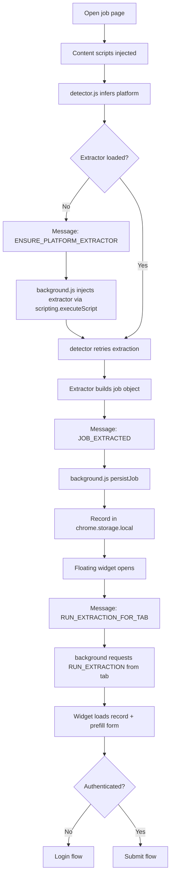
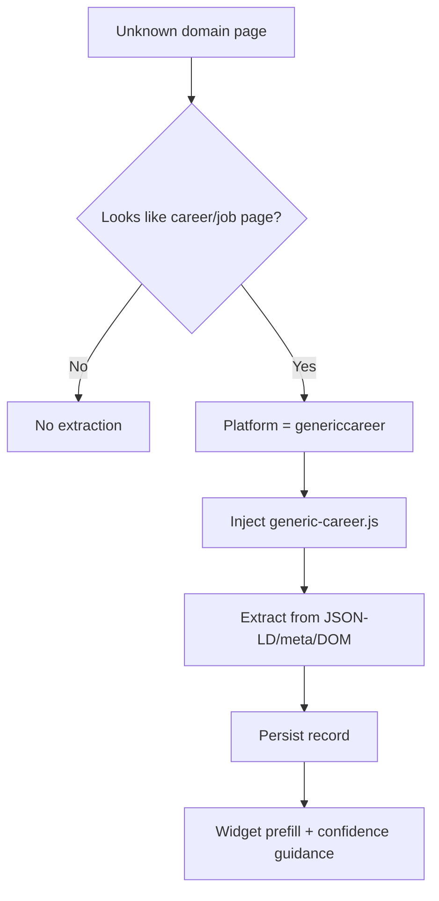
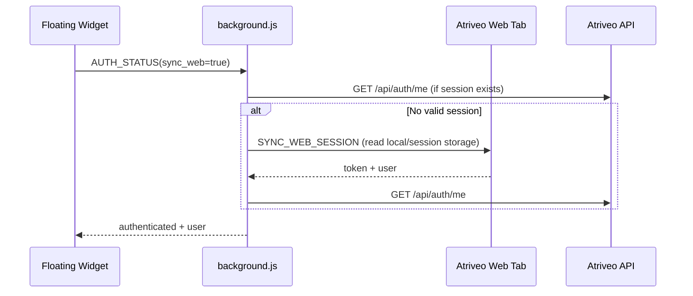
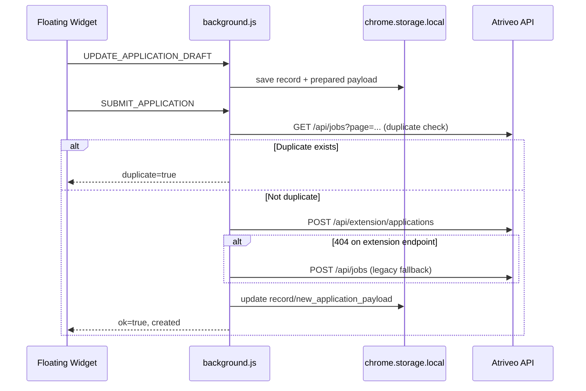

# Atriveo Chrome Extension: End-to-End Documentation

## 1. Purpose
The Atriveo Chrome extension captures job data from ATS/career pages, prepares an application draft, and submits it to Atriveo APIs with duplicate prevention and auth checks.

## 2. High-Level Architecture
- `manifest.json`: MV3 config, permissions, content script injection scope.
- `background.js`: central orchestrator for storage, API calls, auth sync, extraction triggers, submission.
- `content-scripts/detector.js`: page platform detection + extractor execution/retry logic.
- `content-scripts/*extractor*.js`: platform-specific and generic extractors (Workday, Greenhouse, Lever, Generic ATS, Generic Career).
- `content-scripts/floating-widget.js`: in-page assistant UI for scan/edit/login/submit.
- `utils/extractText.js`: shared extraction helpers used by extractors.

## 3. End-to-End Flow (Main Path)

## 4. Fallback for Non-ATS Career Pages
The extension supports unknown company career pages using a generic fallback:
- detector heuristics (URL path/query/title/body) classify page as `genericcareer`.
- background maps `genericcareer` to `content-scripts/generic-career.js`.
- extractor uses JSON-LD (`JobPosting`) + meta + DOM heuristics.
- confidence is attached (`high|medium|low`) and surfaced in widget status.

## 5. Auth + Session Sync Flow

## 6. Submit Flow

## 7. Storage Model
Keys in `chrome.storage.local`:
- `jobsByUrl`: map of URL -> record.
- `latestJob`: last captured record.
- `preparedPayload`: backend-ready payload.
- `lastUpdated`: timestamp.
- `authSession`: extension session token+user.
- `apiBaseUrl`: custom/default API base URL.

Record shape:
- `extracted_job`: normalized extractor output.
- `new_application_payload`: editable payload for submission.
- `payload_version`: currently `v1`.
- `captured_at`: ISO timestamp.

## 8. Message Contracts (Content Scripts <-> Background)
Incoming to background:
- `JOB_EXTRACTED`
- `GET_JOB_FOR_URL`
- `GET_LATEST_JOB`
- `GET_PREPARED_PAYLOAD`
- `RUN_EXTRACTION_FOR_TAB`
- `AUTH_STATUS`
- `ENSURE_PLATFORM_EXTRACTOR`
- `OPEN_LOGIN_PAGE`
- `SYNC_WEB_SESSION`
- `UPDATE_APPLICATION_DRAFT`
- `LOGOUT`
- `SUBMIT_APPLICATION`

Tab-directed message from background:
- `RUN_EXTRACTION` (sent to detector in active tab)

## 9. Validation + UX Guardrails
- Required fields before submit: `job_title`, `company`, `job_link`.
- `job_link` must be valid `http/https`.
- Missing required fields are highlighted in widget.
- Confidence-aware status:
  - missing required fields -> partial extraction warning
  - low confidence -> review warning
  - medium confidence -> review hint
  - high confidence -> ready/login status

## 10. Permissions and Injection Scope
Current manifest broad scope for fallback support:
- `host_permissions`: `https://*/*`, `http://*/*` (+ explicit hosts)
- content script matches: `https://*/*`, `http://*/*`
- excludes Atriveo app/API domains via `exclude_matches`

## 11. Version Notes
- Source implementation: `extension/`
- Packaged implementation: `release/atriveo-job-assistant-v1.0.4/`
- Both should stay in sync before zipping.
